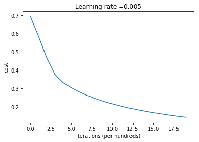
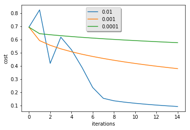
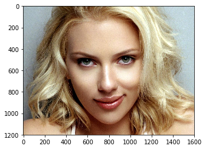
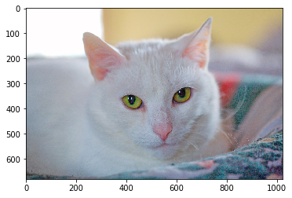

# Logistic Regression Classifier

This project will build a logistic regression classifier to recognize cats.

## Workflow

- Build the general architecture of a learning algorithm, including:
	- Initializing parameters
	- Calculating the cost function and its gradient
	- Using an optimization algorithm (gradient descent)
- Gather all three functions above into a main model function, in the right order.

## Packages

To run this project, import all the packages:
- [numpy](http://www.numpy.org/) is the fundamental package for scientific computing with Python
- [h5py](http://www.h5py.org/) is a common package to interact with a dataset that is stored on an H5 file.
- [matplotlib](https://matplotlib.org/) is a famous library to plot graphs in Python.
- [PIL](http://www.pythonware.com/products/pil/) and [scipy](https://www.scipy.org/) are used here to test your model with your own picture at the end.

## Notes

- Preprocessing the dataset is important
- Implement each function separately: `initialize()`, `propagate()`, `optimize()`. Then build a `model()`
- Tuning the __learning rate__ (which is an example of a "hyperparameter") can make a big difference to the algorithm.

## Results

#### Learning Rate at 0.005

```
Cost after iteration 0: 0.693147
Cost after iteration 100: 0.584508
Cost after iteration 200: 0.466949
Cost after iteration 300: 0.376007
Cost after iteration 400: 0.331463
Cost after iteration 500: 0.303273
Cost after iteration 600: 0.279880
Cost after iteration 700: 0.260042
Cost after iteration 800: 0.242941
Cost after iteration 900: 0.228004
Cost after iteration 1000: 0.214820
Cost after iteration 1100: 0.203078
Cost after iteration 1200: 0.192544
Cost after iteration 1300: 0.183033
Cost after iteration 1400: 0.174399
Cost after iteration 1500: 0.166521
Cost after iteration 1600: 0.159305
Cost after iteration 1700: 0.152667
Cost after iteration 1800: 0.146542
Cost after iteration 1900: 0.140872
train accuracy: 99.04306220095694 %
test accuracy: 70.0 %
```



#### Different Learning Rate Comparison

```
learning rate is: 0.01
train accuracy: 99.52153110047847 %
test accuracy: 68.0 %

-------------------------------------------------------

learning rate is: 0.001
train accuracy: 88.99521531100478 %
test accuracy: 64.0 %

-------------------------------------------------------

learning rate is: 0.0001
train accuracy: 68.42105263157895 %
test accuracy: 36.0 %

-------------------------------------------------------
```



#### Predict Real Images

y = 0.0, your algorithm predicts a "non-cat" picture.



y = 1.0, your algorithm predicts a "cat" picture.

